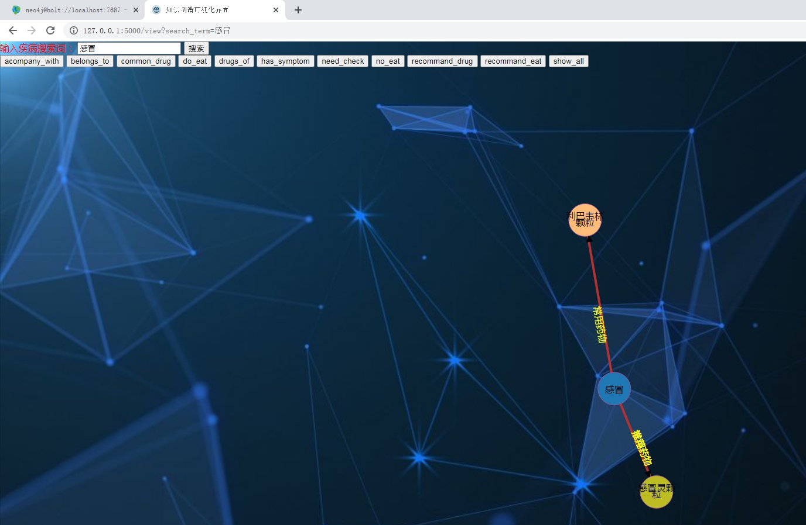

## 计算机毕业设计Python+知识图谱大模型AI医疗问答系统 健康膳食推荐系统 食谱推荐系统 医疗大数据 机器学习 深度学习 人工智能 爬虫 大数据毕业设计

## 要求
### 源码有偿！一套(论文 PPT 源码+sql脚本+教程)

### 
### 加好友前帮忙start一下，并备注github有偿纯python医疗问答系统
### 我的QQ号是2827724252或者798059319或者 1679232425或者微信:bysj2023nb

# 

### 加qq好友说明（被部分 网友整得心力交瘁）：
    1.加好友务必按照格式备注
    2.避免浪费各自的时间！
    3.当“客服”不容易，repo 主是体面人，不爆粗，性格好，文明人。
## 演示视频
https://www.bilibili.com/video/BV199qaY2EAV/?spm_id_from=333.999.0.0
## 运行截图

	
## 设计总说明
本设计项目旨在开发基于Neo4j的医疗知识图谱可视化系统。近年来，随着医疗数据量的迅速增长，知识图谱作为一种将不同实体和关系关联并可视化的工具，为医学领域的研究和应用提供了新的机会。本项目的任务来源于希望通过知识图谱整合医疗领域的多源数据提供一种直观、交互的方式来探索医疗信息的关联性。为了确保设计质量和系统稳性，本项目遵循以下设计标准：具备扩展能力，能够添加新的实体和关系，支持未来需求的变化；提供直观、易用的可视化界面，帮助用户快速理解知识图谱的结构；具有良好的交互体验，用户可以轻松浏览、搜索和探索知识图谱；保持高效的性能，即使面对大量数据和复杂查询，也应保持响应迅速；系统应确保数据的安全与隐私，防止未经授权的访问和数据泄露。在设计过程中，本项目采用以下原则：系统的设计应分为独立模块，以便于维护和扩展；设计需具备一定的灵活性，能够适应不同的应用场景；界面设计应注重用户体验，确保易用性和可操作性；系统应具备稳健性，确保运行稳定。同时本项目的创新点为将医疗小助手与可视化界面联合起来，而不是使两个系统孤立开来。医疗小助手回答中会将系统中储存的疾病关键词标红，用户可以提供点击任意标红疾病关键词跳转至可视化界面，并直接生成对应的知识图谱。

本项目使用了多种技术和工具，以下是主要的技术资料：Neo4j官方文档，提供了图数据库的使用方法和最佳实践，为知识图谱的构建提供指导；Py2neo库，这是一个与Neo4j交互的Python库，帮助实现节点和关系的创建及查询；Flask框架，一个轻量级的Web框架，用于构建后端服务和API；D3.js库，用于知识图谱的可视化，提供了丰富的交互功能。设计过程主要包括以下步骤：确定系统需要构建哪些实体和关系，明确系统的功能需求；构建系统的总体架构，确定数据库设计和模块划分；定义知识图谱中的实体、关系和属性，并使用Neo4j实现；使用Flask构建后端服务，使用Py2neo与Neo4j交互，前端使用D3.js进行可视化；对系统进行测试，修复错误，确保系统稳定运行；将系统部署到目标环境，制定维护计划。

本项目成功构建了一个完整的医疗知识图谱可视化系统，主要结果如下：在该知识图谱系统中，构建了涵盖疾病、症状、药物、科室等实体，以及实体之间的各种关系；系统提供了基于D3.js的可视化界面，用户可以浏览和探索知识图谱；系统支持多种搜索和查询功能，用户可以搜索实体和关系，进行相关分析；系统在测试中表现良好，能够处理较大规模的数据，保持稳定运行。

本项目通过构建医疗知识图谱可视化系统，为医疗信息管理和研究提供了一种有效工具。尽管在设计过程中遇到了一些挑战，但最终实现了预期目标，为后续研究和应用打下了基础。
## 技术路线
数据收集与整合： 首先，需要收集来自多个来源的数据，包括文本数据、结构化数

据和半结构化数据。这些数据来自于公开数据集、网络抓取、API接口等渠道。然后，利

用数据整合技术将这些数据进行处理和整合，构建知识图谱的数层。

本体建模与规范化： 接下来，设计和建立知识图谱的模式层。可以借助本体描述语言（如OWL）来进行本体建模，并严格规范模式层的结构和约束。

知识图谱构建与存储： 利用已经整合和规范化的数据，在构建知识图谱的数据层时，我们选择采用图数据库或三元组存储技术来高效地存储和管理知识图谱的数据。这些技术能够准确捕捉和表示图谱中的节点（代表各种实体或概念）以及它们之间的边（代表关联关系），从而确保知识图谱的完整性和准确性，并保证数据的一致性、完整性和可扩展性。

可视化算法与界面设计： 开发可视化算法和用户界面，支持用户对知识图谱中实体、属性和关系的交互式探索。这涉及到图形布局算法、图形渲染技术等，以及用户界面设计原则和实践。

交互式探索与信息检索： 实现交互式探索功能，使用户可以通过图形界面对知识图

谱进行浏览、搜索和查询。开发多层次的信息筛选和检索功能，支持实体搜索、属性分析、关系探索等。系统集成与部署： 将各个模块整合起来，构建完整的基于知识图谱的可视

化系统。进行系统测试和调试，确保系统稳定性和性能。最后，部署系统到相应的平台上，并提供用户友好的配置管理。
## 系统工作流程分析
系统的工作流程可以分为数据整合、知识图谱构建、可视化展示、交互式探索和部署运维几个关键步骤。以下是系统的总体工作流程：

数据整合：从多源数据中提取信息。本系统将从medical.json数据集中对数据进行清洗、格式转换，最后分类成相应的txt文件。

知识图谱构建：运用提取的数据所分类的txt文件，构建知识图谱，包含实体、属性和关系。这一步通常涉及图数据库或其他结构的运用。

可视化展现：采用了前沿的可视化算法技术，旨在为用户提供一个直观且易于理解的展示形式。为实现这一目标，设计了用户界面，并融入了丰富的交互功能，确保用户能够迅速、准确地理解和操作这一知识图谱，从而更有效地挖掘和利用其中的信息与资源。这种设计不仅提升了用户体验，也极大地提高了知识图谱的实用价值。

交互式探索：用用户能够借助精心设计的界面与知识图谱进行深度互动。这一过程中，用户不仅能进行实体的精确搜索，还能深入探索实体间的关系网络，并进行详尽的属性分析。这种多层次的交互方式，为用户提供了更为全面和细致的知识图谱体验。

智能问答：用户通过可视化界面与智能医疗助手提问互动，得到所需答案。

## 系统总体架构
    数据集成层：负责数据收集和整合。该层提供数据源接口和数据处理逻辑，其中知识图谱的基本单元是由不同来源的数据转换而来。

知识图谱构建层：支持实体、属性和关系的多维度关联，将处理后的数据构建为知识图谱。

可视化层：负责将知识图谱数据可视化，提供交互式界面。该层需要设计良好的用户界面，以便用户操作。

信息检索和分析层：提供搜索和分析工具，支持多层次信息筛选和检索。该层可以支持复杂的查询和关系探索。

部署和运维层：负责系统的部署、配置和维护，确保系统的稳定性和安全性。

## 系统模块划分
数据源接口模块：连接和提取来自多源数据的内容，可能涉及文本分析、数据转换等功能。

知识图谱构建模块：根据数据源接口模块提供的数据，构建知识图谱。这可能涉及图数据库的设计与操作。

可视化与交互模块：负责知识图谱的可视化和用户界面的设计，提供交互功能。

信息检索与分析模块：提供信息筛选、检索和分析的功能。该模块与可视化与交互模块协同工作，支持用户的不同需求。

